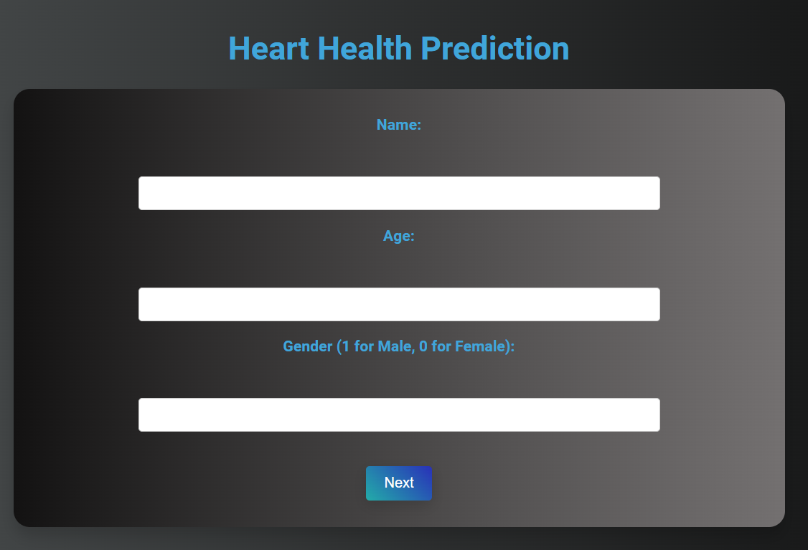
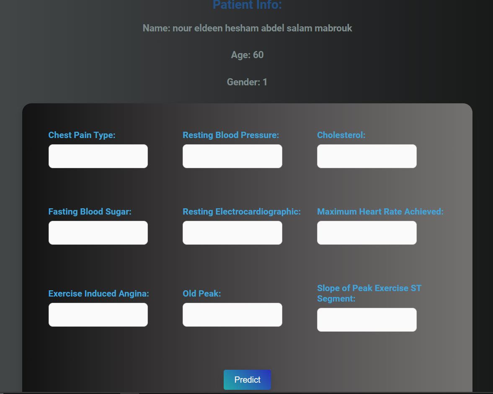

# Heart Disease Prediction Web Application

## Description
This project is a Flask-based web application designed to predict the likelihood of heart disease based on various health metrics. It leverages machine learning models, including XGBoost and Random Forest, to analyze patient data and provide insights into heart health. The interactive UI allows users to input their health metrics and receive predictions in real-time, enhancing user engagement and awareness of heart disease risks.

## Table of Contents
- [Heart Disease Prediction Web Application](#heart-disease-prediction-web-application)
  - [Description](#description)
  - [Table of Contents](#table-of-contents)
  - [Features](#features)
  - [Technologies Used](#technologies-used)
  - [Installation](#installation)
  - [Usage](#usage)
  - [API Endpoints](#api-endpoints)
    - [Predict Heart Disease](#predict-heart-disease)
  - [Model Accuracy](#model-accuracy)
  - [Data Sources](#data-sources)
  - [Images](#images)
    - [Application Screenshot](#application-screenshot)
  - [Contributing](#contributing)
  - [License](#license)

## Features
- **Interactive User Interface**: Easy-to-use web interface for data input and prediction.
- **Real-Time Predictions**: Get instant predictions based on user-provided health metrics.
- **Data Visualization**: Visual insights into the distribution of heart disease cases and correlations between features.
- **Machine Learning Models**: Utilizes advanced models such as XGBoost and Random Forest for accurate predictions.
- **Data Preprocessing**: Includes robust data cleaning and preprocessing steps to ensure high-quality input data.

## Technologies Used
- **Backend**: Flask
- **Frontend**: HTML, CSS
- **Machine Learning**: Scikit-learn, XGBoost
- **Data Visualization**: Matplotlib, Seaborn
- **Database**: SQLite (or any preferred database)
- **Others**: Pandas, NumPy

## Installation
1. Clone the repository:
   ```bash
   git clone https://github.com/n-hesham/heart-disease-prediction.git
   cd heart-disease-prediction
   ```
2. Create a virtual environment:
   ```bash
   python -m venv venv
   source venv/bin/activate  # On Windows use `venv\Scripts\activate`
   ```
3. Install the required packages:
   ```bash
   pip install -r requirements.txt
   ```

## Usage
1. Start the Flask server:
   ```bash
   python app.py
   ```
2. Open your web browser and navigate to `http://127.0.0.1:5000`.

## API Endpoints
### Predict Heart Disease
- **Endpoint**: `/predict`
- **Method**: POST
- **Request Body**:
  ```json
  {
    "Age": 40,
    "Sex": 1,
    "ChestPainType": 2,
    "RestingBP": 140,
    "Cholesterol": 289,
    "FastingBS": 0,
    "RestingECG": 0,
    "MaxHR": 172,
    "ExerciseAngina": 0,
    "Oldpeak": 0.0,
    "ST_Slope": 1
  }
  ```
- **Response**:
  ```json
  {
    "HeartDisease": 0,
    "Probability": 0.85
  }
  ```

## Model Accuracy
The machine learning models used in this application have been evaluated using cross-validation techniques. The models achieve the following accuracy: 97.61% accuracy

These metrics indicate the models' effectiveness in predicting heart disease based on the dataset used.

## Data Sources
- [Heart Disease Dataset](https://www.kaggle.com/api/v1/datasets/download/mexwell/heart-disease-dataset)
- [Heart Failure Prediction Dataset](https://www.kaggle.com/api/v1/datasets/download/fedesoriano/heart-failure-prediction)

## Images
Here are some images showcasing the application and its results:

### Application Screenshot




## Contributing
Contributions are welcome! Please follow these steps:
1. Fork the repository.
2. Create a new branch (`git checkout -b feature-branch`).
3. Make your changes.
4. Commit your changes (`git commit -m 'Add new feature'`).
5. Push to the branch (`git push origin feature-branch`).
6. Open a pull request.

## License
This project is licensed under the MIT License - see the [LICENSE](LICENSE) file for details.
